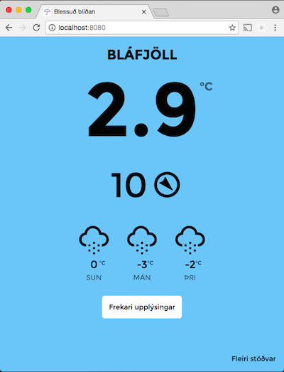
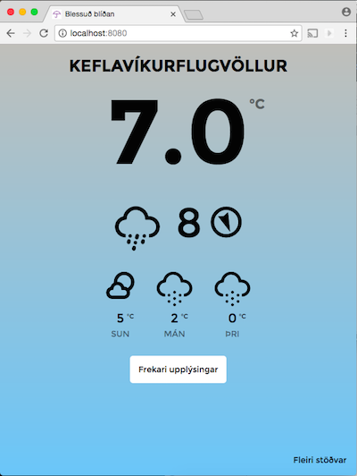
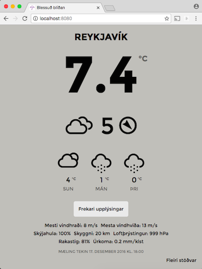
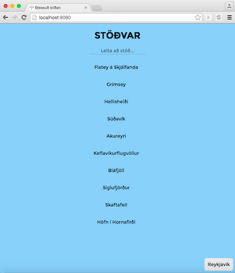
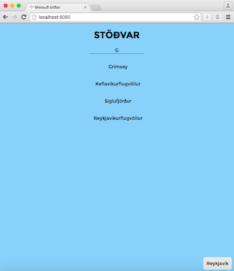
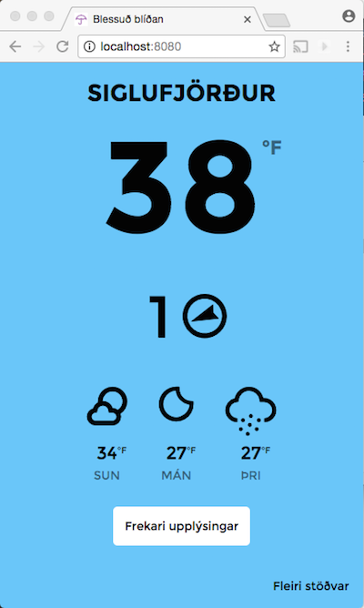

<<<<<<< HEAD
# Blessuð blíðan
***
Weather app with an [Angular](https://angularjs.org/) front end and a backend REST service written in [Go](https://golang.org/). Uses local storage to store fetched weather information. Weather information fetched from the [Icelandic Meteorological Office](http://www.vedur.is/) with the help of [APIS.is](https://github.com/apis-is/apis).

## Setup
***
When in the root directory, start the app by typing:

`$ go build`

`$ weather`

## Testing
***
Testing requires [Protractor](http://www.protractortest.org/#/) and Selenium Server. Go into the _test_ directory and type

`$ webdriver-manager update`

Then start a Selenium Server

`$ webdriver-manager start`

Run the tests

`$ protractor conf.js`

## Screenshots
***

## Dependencies
***
* [Angular Local Storage](https://github.com/grevory/angular-local-storage)
* [Moment](http://momentjs.com/)
* [SunCalc](https://github.com/mourner/suncalc)
* [Normalize CSS](https://necolas.github.io/normalize.css/)
* [Weather Icons](https://erikflowers.github.io/weather-icons/) by Erik Flowers
=======
# Weather
Small Angular weather app running on a Go server.
>>>>>>> 84cfcf9a23df48ab4e7889e5a9d120b7ec47bdda
